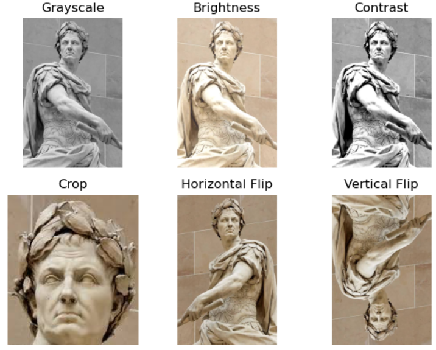

# Image Processor

A image processing project built with Python, NumPy, PIL, and Matplotlib. This project explores fundamental image manipulation techniques by performing transformations directly on image arrays.

## Features

* Image size and dimension analysis
* Image data type and pixel-range analysis
* Grayscale conversion
* Brightness adjustment
* Contrast adjustment
* Image cropping
* Horizontal flipping
* Vertical flipping
* Visual comparison of all transformations

## Tech Stack

| Technology | Purpose |
|------------|---------|
| Python | Core programming language |
| NumPy | Image array manipulation and numerical operations |
| Pillow | Image conversion and processing |
| Matplotlib | Image loading and visualization |
| Jupyter Notebook | Development and experimentation |

## How It Works

The project loads an RGB image and converts it into a NumPy array for processing.

The following operations are implemented from scratch using array manipulation:

1. **Grayscale** — Converts RGB values into a single grayscale channel using weighted RGB values.
2. **Brightness** — Adds a specified value to pixel intensities while keeping values within the valid 0–255 range.
3. **Contrast** — Adjusts pixel values around the midpoint using a configurable contrast factor.
4. **Crop** — Extracts a selected region of the image using array slicing.
5. **Horizontal Flip** — Reverses the image along its horizontal axis.
6. **Vertical Flip** — Reverses the image along its vertical axis.

The results are then displayed together for visual comparison.

## Project Structure

```text
image-processor/
│
├── Image_processor.ipynb
├── README.md
├── requirements.txt
└── images.jpg
```

> The output images generated while running the notebook are not stored as a separate folder in the repository. Instead, the final processed results are showcased in this README.

## Results

The notebook demonstrates the original image alongside the following transformations:

* Grayscale
* Brightness adjustment
* Contrast adjustment
* Cropping
* Horizontal flip
* Vertical flip

### Output



## Installation & Usage

### 1. Clone the repository

```bash
git clone https://github.com/Prometheusze/image-processor.git
cd image-processor
```

### 2. Install the dependencies

```bash
pip install -r requirements.txt
```

### 3. Open the notebook

```bash
jupyter notebook Image_processor.ipynb
```

Make sure `images.jpg` is present in the repository before running the notebook.

## Requirements

The project requires:

```text
numpy
matplotlib
Pillow
```

You can install all dependencies using:

```bash
pip install -r requirements.txt
```

## Learning Goals

This project was created to practice:

* Working with NumPy arrays
* Understanding RGB image representations
* Manipulating pixels mathematically
* Using array slicing for image operations
* Understanding how brightness and contrast affect pixel values
* Converting between NumPy arrays and PIL images
* Visualizing image-processing results with Matplotlib

## Future Improvements

* Add more image-processing operations
* Add image rotation and resizing
* Add edge detection
* Add blur and sharpening filters
* Create a simple GUI for selecting operations
* Allow users to process their own images interactively
* Refactor the functions into a reusable Python module

---

⭐ If you found this project useful, consider giving it a star!
